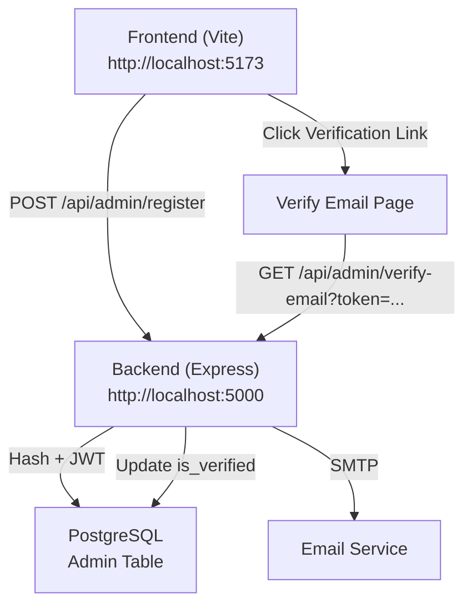

# 🚀 QUICK START - Admin Authentication (18 Février 2026)

## ⚡ Démarrer en 5 Minutes

### 1. Cloner la Config (si besoin)
```bash
# Les fichiers sont déjà dans votre repo!
# Vérifiez juste la structure:
ls backend/src/routes/admin-auth.ts          # ✅ Doit exister
ls backend/src/services/adminAuthService.ts   # ✅ Doit exister
ls src/pages/admin/verify-email/page.tsx      # ✅ Doit exister
```

### 2. Configurer les Environnements

**Backend (.env)**
```bash
cd backend
cat > .env << 'EOF'
DATABASE_URL=postgresql://emploip01_admin:4CS5dw2/JUsXHbPoL@localhost:5433/emploiplus_db
SMTP_HOST=localhost
SMTP_PORT=587
SMTP_USER=admin@emploiplus-group.com
SMTP_PASSWORD=@JzEw*Gv^suGzmOs
SMTP_FROM="Emploi Plus Admin <admin@emploiplus-group.com>"
SMTP_SECURE=false
FRONTEND_URL=http://localhost:5173
JWT_SECRET=emploi_connect_congo_secret_2025
EOF
```

**Frontend (.env.local)**
```bash
cat > .env.local << 'EOF'
VITE_API_BASE_URL=http://localhost:5000
EOF
```

### 3. Migration Base de Données
```bash
cd backend
npx tsx migrations/002-add-admin-profile-fields.ts
```

✅ Attendez "✅ Migration completed successfully!"

### 4. Installer Dépendances
```bash
# Terminal 1 - Backend
cd backend
npm install
npm run build

# Terminal 2 - Frontend
npm install
```

### 5. Démarrer les Serveurs
```bash
# Terminal 1 - Backend
cd backend
npm run dev
# Output: Server running on http://localhost:5000

# Terminal 2 - Frontend
npm run dev
# Output: VITE v5... ready in XXX ms ➜  Local:   http://localhost:5173
```

### 6. Tester Inscription
**Naviguer vers :** http://localhost:5173/admin/register/super-admin

**Remplir le formulaire :**
- Email: test@example.com
- Mot de passe: password123 (min 6 caractères)
- Nom: Dupont
- Prénom: Jean
- Pays: Congo
- Ville: Kinshasa

**Cliquer : "Créer Super Admin"**

✅ Réponse attendue : "Super Admin créé! Un email de validation a été envoyé."

### 7. Vérifier l'Email
**Vérifier les logs backend :**
```
[Mailer] Sending verification email to test@example.com
```

**Récupérer le lien depuis les logs :**
```
Verification URL: http://localhost:5173/admin/verify-email?token=abc123def456...
```

**Copier le lien dans le navigateur :**
- ✅ Page affichera "Email confirmé avec succès!"
- ✅ Redirection auto vers /admin/login après 2 secondes

### 8. Test Connexion
**URL :** http://localhost:5173/admin/login

**Identifiants :**
- Email: test@example.com
- Mot de passe: password123

✅ Réponse attendue : Redirection vers /admin (dashboard)

---

## 🔧 Troubleshooting Rapide

### Problem: "Erreur serveur" lors de l'inscription
```bash
# Vérifier backend est actif
curl http://localhost:5000/api/health

# Voir les logs backend
# Output devrait montrer: "Server running on http://localhost:5000"
```

### Problem: "Email non reçu"
```bash
# Vérifier SMTP dans backend logs
# Chercher: "[Mailer] Sending verification email"

# Si absent, vérifier .env:
# SMTP_HOST, SMTP_PORT, SMTP_USER, SMTP_PASSWORD doivent être corrects
```

### Problem: "Email vérifié mais ne peut pas se connecter"
```sql
-- Vérifier en base:
SELECT * FROM admins WHERE email = 'test@example.com';
-- Vérifier is_verified = true et verification_token = NULL
```

### Problem: "Token invalide lors de vérification"
- Token expiré (24h maximum)
- Token malformé
- Admin déjà vérifié (token déjà consommé)

---

## 💾 Architecture en Production



---

## 📊 Endpoints Disponibles

| Méthode | Route | Auth | Description |
|---------|-------|------|-------------|
| POST | `/api/admin/register` | ❌ | Créer super admin |
| GET | `/api/admin/verify-email?token=X` | ❌ | Vérifier email |
| POST | `/api/admin/login` | ❌ | Connexion admin |
| POST | `/api/admin/create` | ✅ Super | Créer admin par super admin |

---

## 🎯 Cas d'Usage

### Cas 1 : Premier Déploiement
1. Inscription super admin (super-admin/page.tsx)
2. Vérifier email
3. Créer autres admins via dashboard

### Cas 2 : Multi-Admins
1. Super Admin logs in
2. Va à /admin/register/content-admin
3. Crée Content Admin
4. Content Admin reçoit email et vérifie
5. Content Admin peut se connecter

### Cas 3 : Réinitialisation Mot de Passe
```
// TODO: À implémenter
POST /api/admin/forgot-password
POST /api/admin/reset-password?token=X
```

---

## 🔐 Sécurité Activée

✅ Password hashing (bcryptjs, 10 rounds)
✅ JWT tokens (7 jours validité)
✅ Email verification (24h validité)
✅ CORS configuration
✅ Rate limiting
✅ SQL injection protection (pg parameterized queries)

---

## 📝 Logs Utiles

**Backend:**
```
✅ [Auth] Admin created: user@example.com
✅ [Email] Verification link sent
✅ [Auth] Verification successful
✅ [Auth] Login successful for user@example.com
```

**Frontend:**
```
POST http://localhost:5000/api/admin/register (200)
GET http://localhost:5000/api/admin/verify-email?token=... (200)
POST http://localhost:5000/api/admin/login (200)
```

---

## 🚨 Avant Production

- [ ] Changer JWT_SECRET (générer une clé aléatoire)
- [ ] Vérifier SMTP credentials
- [ ] HTTPS activé
- [ ] Database backup effectué
- [ ] Tests par 2-3 utilisateurs
- [ ] Monitoring logs en place

---

**Version:** 1.0.0
**Status:** ✅ Prêt à l'Emploi
**Support:** Voir REFACTORING_MIGRATION_COMPLETE.md

Bon courage! 🚀
